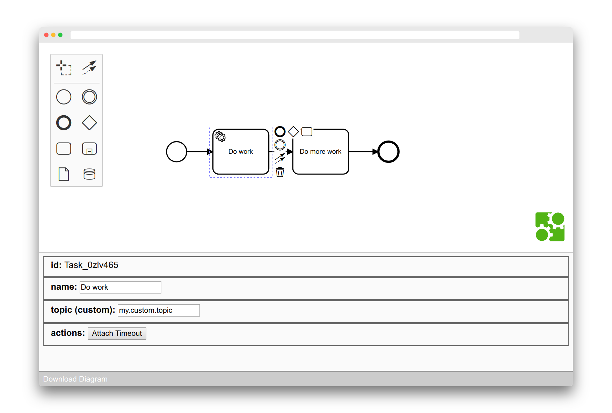

# Extension Demo

This project demonstrates how to embed [bpmn-js](https://github.com/bpmn-io/bpmn-js) into an application and customize it in a domain specific manner.




## Features

Specifically, we feature

* [Reducing the palette](./src/modeler/features/reduced-palette)
* [Reducing the context pad](./src/modeler/features/reduced-context-pad)
* [Adding a custom properties panel](./src/properties-panel), built with [React](https://reactjs.org/)


Within the properties panel, we feature

* Displaying and editing BPMN element properties
* Displaying and editing of [custom extensions](./src/modeler/moddle/custom.json)
* Implementing diagram actions such as changing an elements type


## Run the Demo

```sh
npm install
npm start
```


## License

MIT
